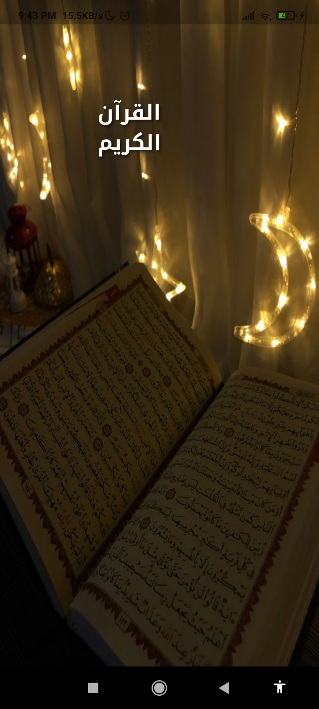
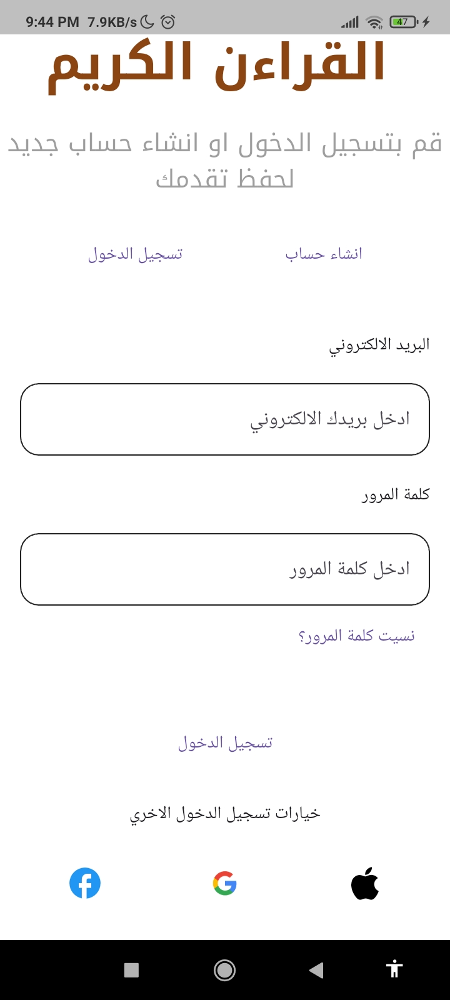
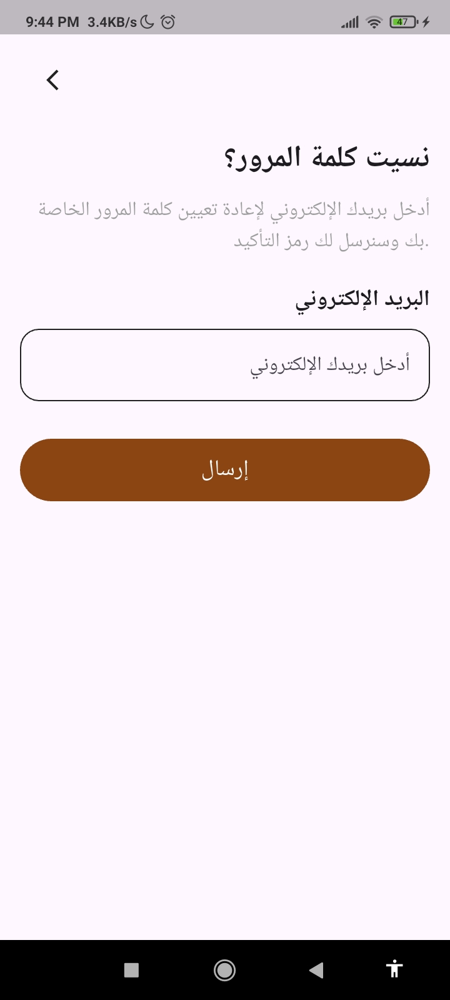
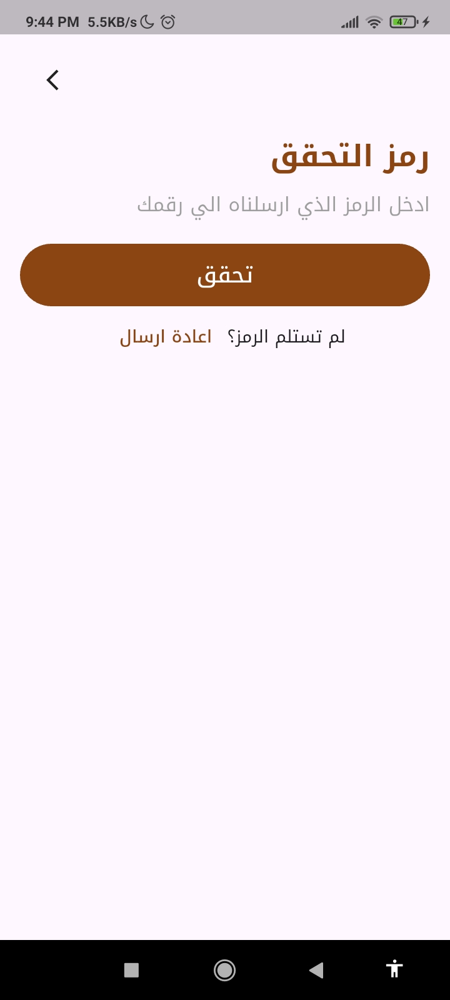
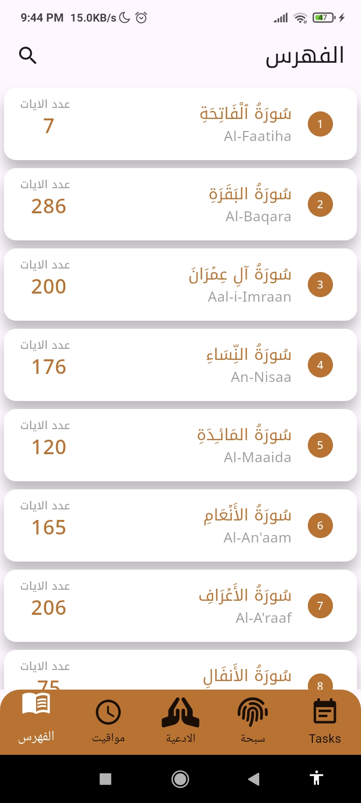
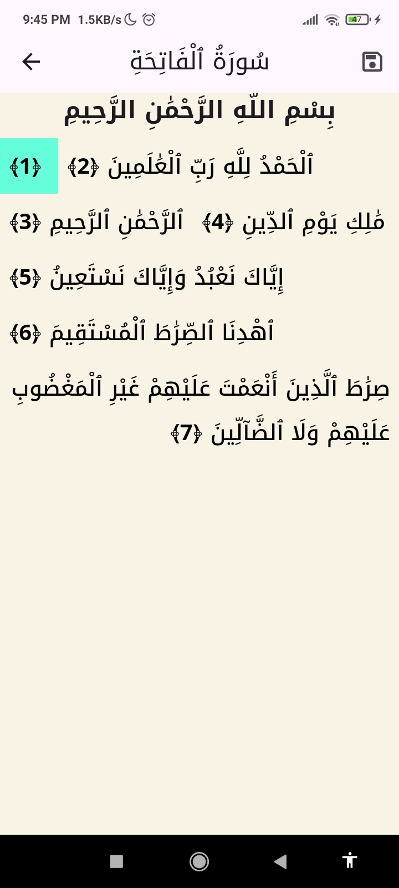
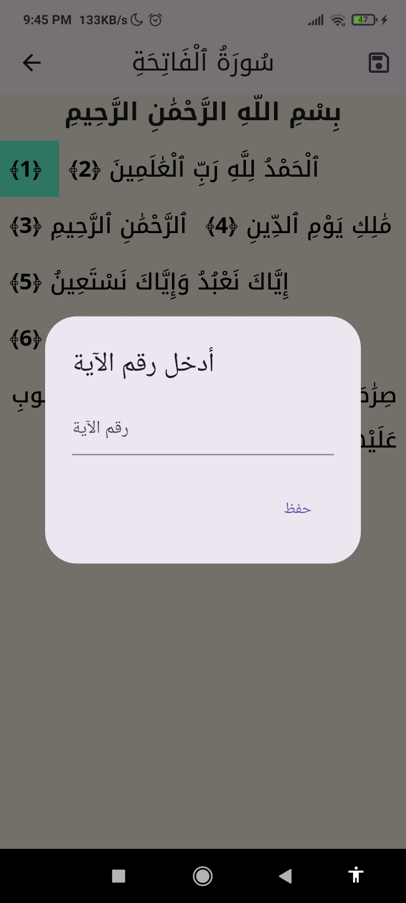
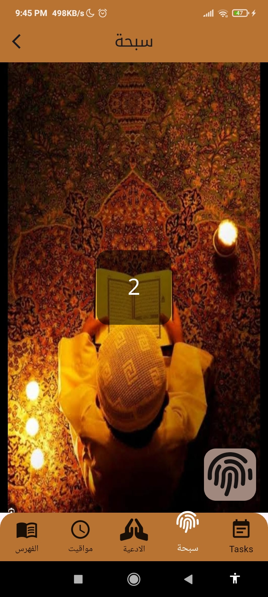
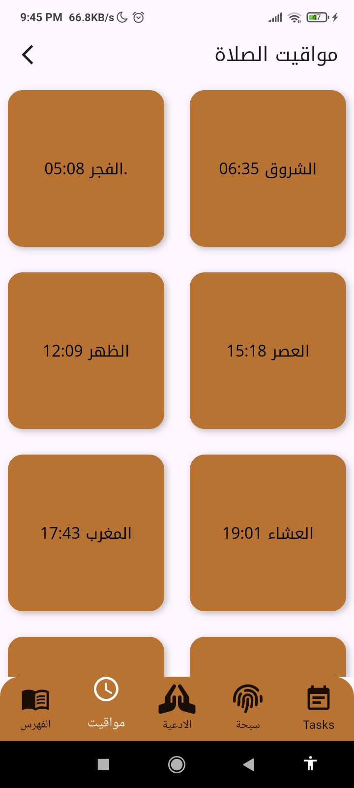
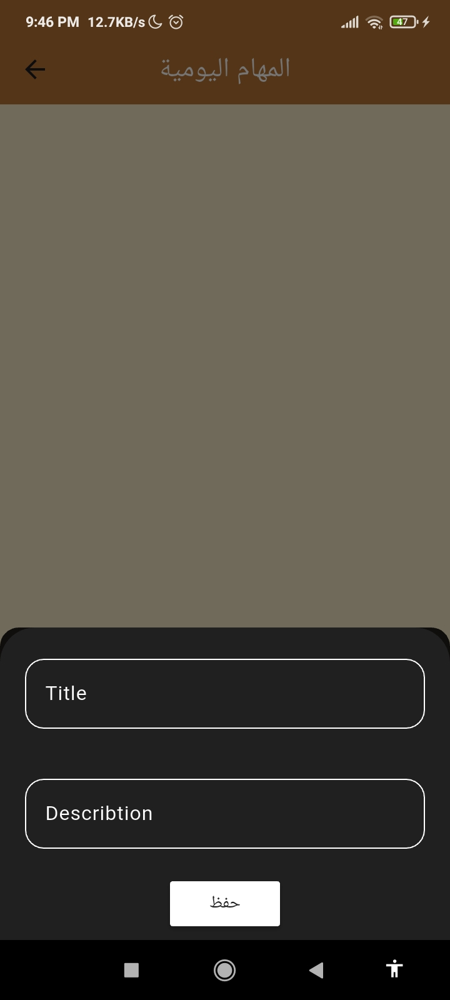

# 🕌 Islamic App (Flutter)

A beautifully designed Islamic mobile application built with Flutter to support daily Muslim spiritual practices.

The app provides Quran reading (text & audio), Tasbeeh counter, task tracking, and real-time prayer times using an external API — all in a clean and intuitive interface.

---

## 📌 Overview

Islamic App is designed to help users stay connected to their daily religious habits through a simple and elegant mobile experience.

It combines offline functionality with online services, ensuring accessibility anytime, anywhere.

---

## 🌟 Key Features

- 📖 **Quran Reader**
  - Read Holy Quran (Surahs & Ayat)
  - Audio playback support for recitation

- 📿 **Digital Tasbeeh**
  - Counter for dhikr (ذِكر)
  - Saved progress for daily remembrance

- ✅ **Daily Tasks System**
  - Create and track Islamic daily habits
  - Task completion tracking

- 🕋 **Prayer Times**
  - Real-time prayer schedule
  - Integrated external API for accurate timings

- 📚 **Offline Storage**
  - Save Surahs, Ayat, and user progress locally
  - Fast access using SQLite database

---

## 🛠️ Tech Stack

- Flutter & Dart  
- Cubit (State Management)  
- Firebase  
- SQLite (Local Database)  
- External Prayer Times API  
- MVC Architecture  

---

## 🧠 Technical Highlights

- Clean MVC architecture  
- Offline-first design using SQLite  
- API integration for prayer times  
- Efficient state management using Cubit  

---

## 📂 Main Modules

- Quran Module  
- Tasbeeh Module  
- Prayer Times Module  
- Tasks Module  
- Local Storage Module  

---

## 📸 Screenshots

---
### Auth 
<p align="center">
  
  
  
  
  
</p>

### 📖 Quran Module

<p align="center">
  
  
  
</p>

---

### 📿 Tasbeeh Counter

<p align="center">
  
</p>

---

### 🕋 Prayer Times

<p align="center">
  
</p>

---

### ✅ Tasks System

<p align="center">
  
  
</p>

---

## 🚀 Getting Started

```bash
git clone https://github.com/Basmala-hub/Islamic.git
cd Islamic
flutter pub get
flutter run